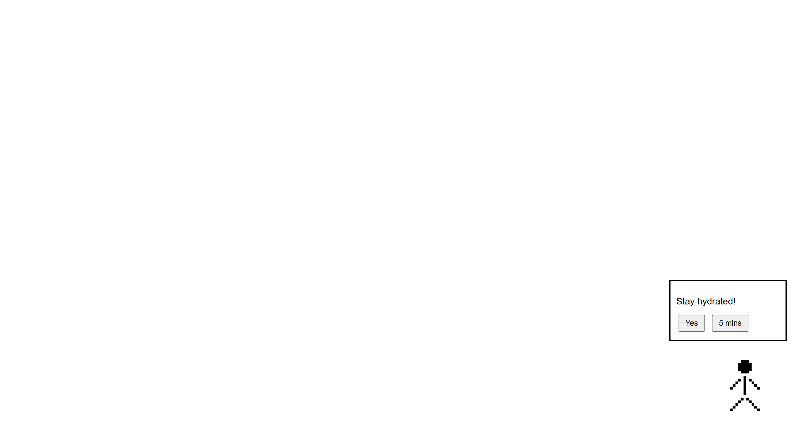
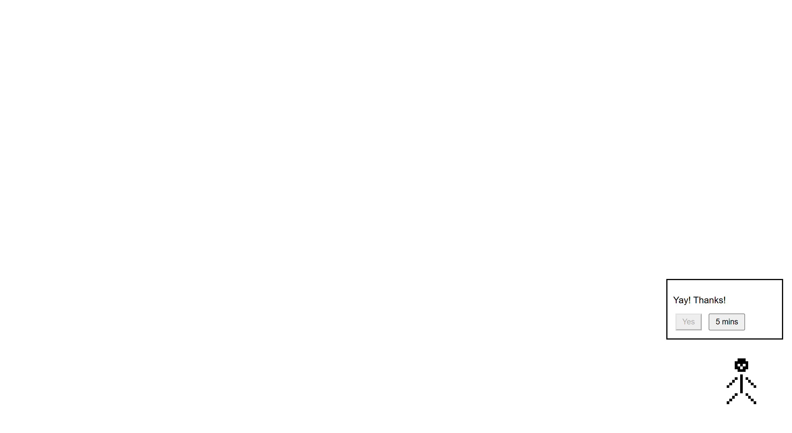

# NEERA

Neera is a water buddy. She reminds users to be hydrated at all times. All of us these days are very much invested in the digital world. I feel like NEERA could help us, users in that way.

# What Neera does?

* Walks into the users dektop once every 2 hours (so that overhydration doesn't happen)
* Asks a basic but important question to the user
* Question being - "Had water?"
* User gets 2 options - "Yes" or "5 mins"
* This makes it interactive and doesn't make it monotonous.

# Why I made it

As a frequent digital user myself, I have faced issues like dehydration and have seen many people and friends suffer from the same problem. To prevent this from getting worse I made NEERA. She makes sure that the user drinks water every 2 hours.

# Tools used to build Neera

1. HTML
2. CSS
3. JavaScript
4. Piskel for the pixel charcater (Neera)

# Screenshots

* NEERA reminder 


* NEERA response


# Demo URL

https://tanishga.github.io/NEERA/

# How to run NEERA 

* User can download or close this repository.
* Open `index.html` in a web browser.
* NEERA will appear on the screen and you can interact with her.

# Project structure

```text
NEERA
|
|___ images
|    |__ neera_happy.png
|    |__ neera_idle.png
|    |__ neera_walk1.png
|    |__ neera_walk2.png
|
|___ screenshots
|    |__ neera_reminder.png
|    |__ neera_response.png
|___ index.html
|___ LICENSE
|___ README.md
|___ script.js
|___ style.css
```

# How I used AI

I used ChatGPT when I got stuck in JavaScript. It helped me find small mistakes like missing semicolons, in my code.  Otherwise, the look and functionality of NEERA were my own decision and I made the pixel character myself.

# License

This projects is licensed under the MIT license. See the license file for more details.

# Project Owner 

*Tanishga Ravikumar Priya*
